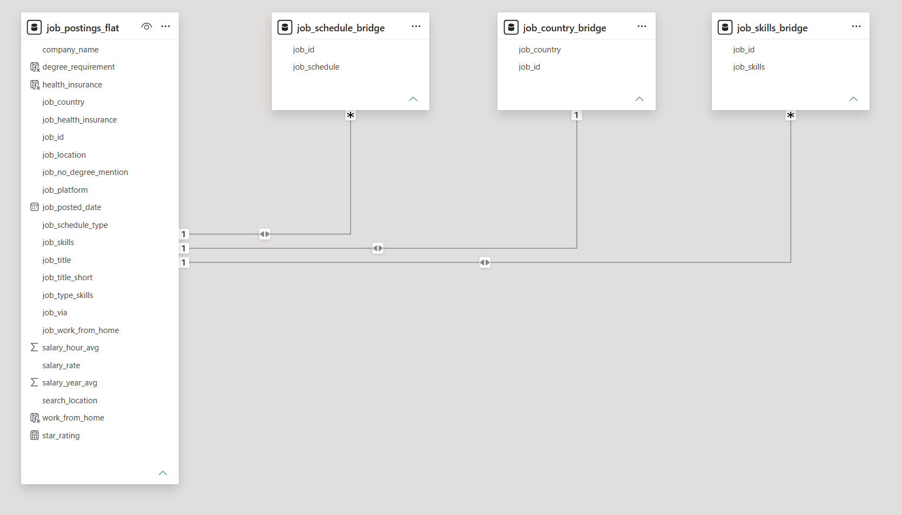
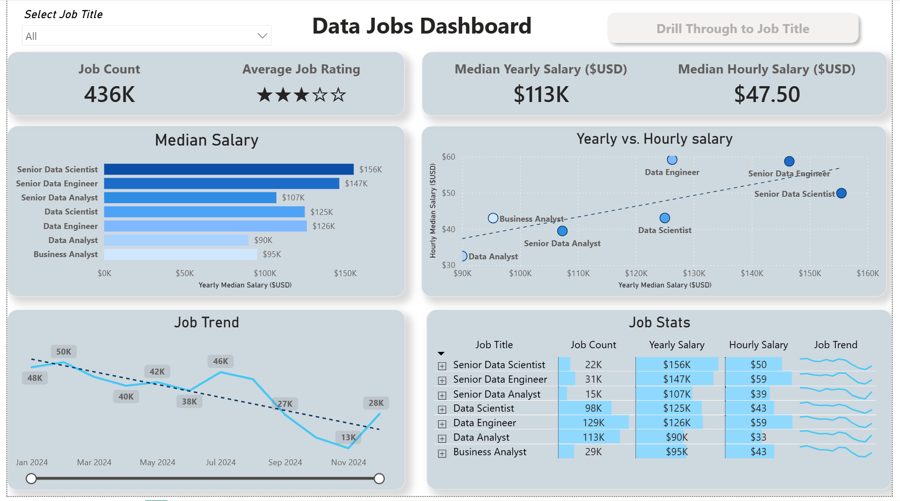
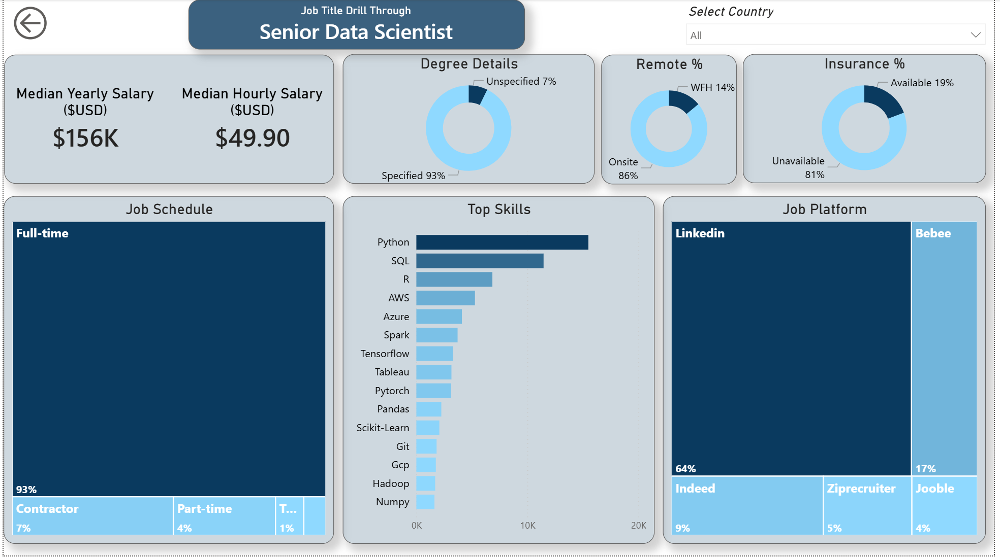

# 📊 Data Jobs Business Intelligence Dashboard

## Overview

This project analyzes approximately **436,000 job postings** from the global data job market using Power BI.

The dashboard explores compensation trends, hiring demand, skill requirements, job platforms, remote-work patterns, and job-title performance through interactive reports, drill-through navigation, and a custom data model.

The project demonstrates an end-to-end Business Intelligence workflow including:

* Data transformation using Power Query
* Relational data modeling
* Bridge-table implementation
* DAX calculations
* Interactive dashboard development
* Drill-through reporting
* Business insight generation

---

## 🛠️ Tools & Technologies

* Power BI
* Power Query
* DAX
* Data Modeling
* Bridge Tables
* Data Visualization

---

## 📂 Dataset

The dataset contains approximately **436K global job postings** including:

* Job Titles
* Salaries
* Skills
* Hiring Platforms
* Work Schedule Types
* Remote Work Information
* Geographic Information
* Insurance Benefits
* Company Ratings

(Note: Dataset files are not included due to size constraints.)

---

## 🏗️ Data Model

To support multi-value fields and advanced analysis, custom bridge tables were created for:

* Skills
* Countries
* Job Schedules

This structure enables accurate filtering and aggregation across many-to-many relationships.

### Data Model



---

## 📈 Dashboard Features

### Executive Dashboard

Provides a high-level view of the job market:

* Job Count
* Average Job Rating
* Median Salary
* Median Hourly Salary
* Salary Trends
* Job Demand Trends
* Job-Level Performance Comparison



---

### Job Title Drill-Through Analysis

Users can drill into individual job titles to explore:

* Salary Metrics
* Top Skills
* Hiring Platforms
* Work Schedule Distribution
* Remote Work Availability
* Insurance Benefits
* Degree Requirements



---

## 💡 Key Business Insights

### Compensation

* Senior Data Scientist roles command the highest median salaries.
* Data Engineering positions consistently rank among the highest-paying roles.

### Skills

* Python and SQL remain the most requested skills across data jobs.
* Specialized technical skills are associated with higher compensation.

### Hiring Trends

* Full-time roles dominate the market.
* LinkedIn is the leading hiring platform across multiple job categories.

### Workforce Patterns

* Most postings remain onsite.
* Remote opportunities vary significantly by job title.

---

## ⚙️ Technical Highlights

### Power Query

* Data cleaning and transformation
* Handling multi-value fields
* Data preparation for modeling

### Data Modeling

* Custom bridge tables
* Relationship design
* Many-to-many relationship management

### DAX

* Salary KPIs
* Rating calculations
* Job demand metrics
* Dynamic filtering measures

### Reporting

* Interactive dashboards
* Drill-through navigation
* Cross-filtering
* KPI cards
* Trend analysis

---

## 📁 Repository Structure

```text
data-jobs-business-intelligence-dashboard/
│
├── dataset/
│   └── data_jobs.csv
│
├── powerbi_project/
│   └── Data_Jobs_Dashboard.pbix
│
├── images/
│   ├── dashboard_preview/
│   │   ├── executive_dashboard.png
│   │   └── job_title_drillthrough.png
│   │
│   └── data_model/
│       └── data_model_relationships.png
│
└── README.md
```

---

## 🎯 Learning Outcomes

* Designed a scalable Power BI data model.
* Implemented bridge tables for multi-valued attributes.
* Built interactive dashboards and drill-through reports.
* Applied DAX for dynamic business metrics.
* Converted raw job-posting data into actionable business insights.
